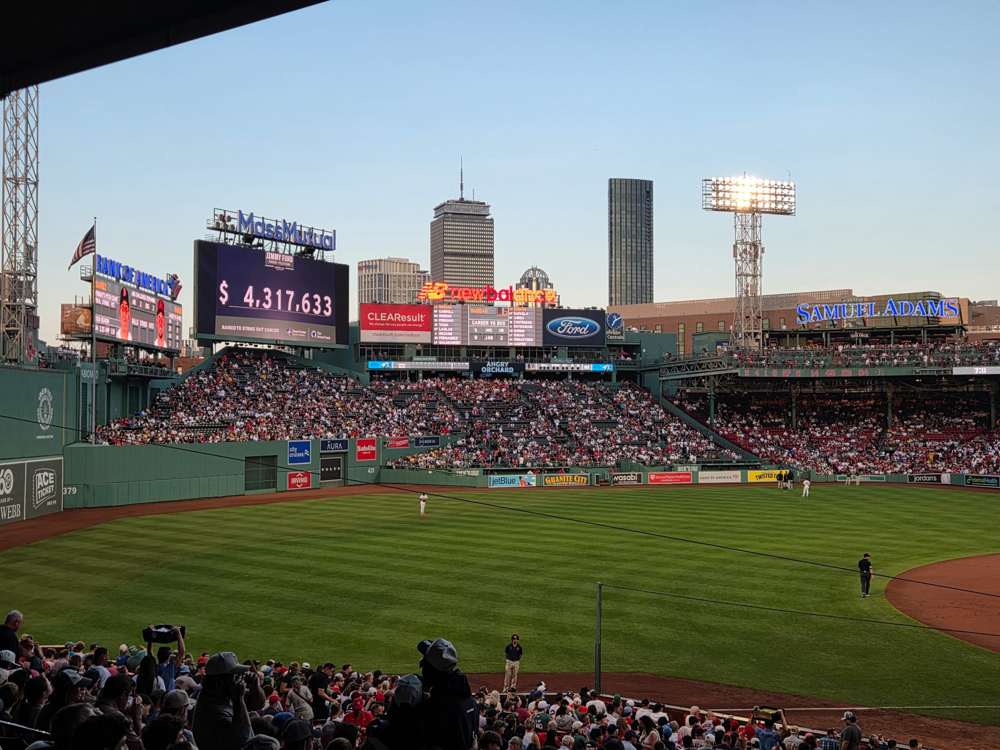

## Marketing | Business | Analytics

I am a marketing professional currently expanding my technical and analytical skills through graduate study in business analytics at Boston University Metropolitan College.

My interests sit at the intersection of **marketing, business strategy, and data analytics**, with a focus on using data to uncover insights and support better business decisions.

{width="45%" fig-align="center"}

## Explore My Portfolio

Use the navigation above to learn more about my background, explore selected analytics projects, view my CV, and connect with me.

- **[About Me](about.qmd)** — Learn more about my background, interests, and career goals.
- **[Projects](projects.qmd)** — Explore selected academic and analytics projects.
- **[CV](cv.qmd)** — View my professional background and download my CV.
- **[Contact](contact.qmd)** — Find my email, LinkedIn, and GitHub.